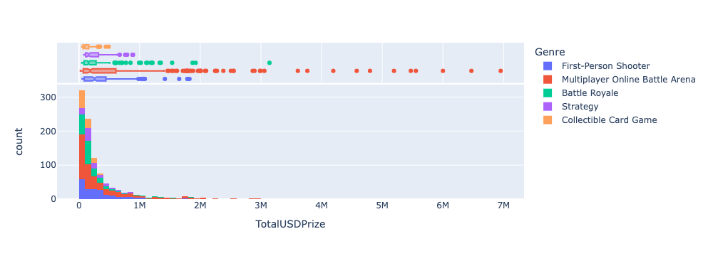
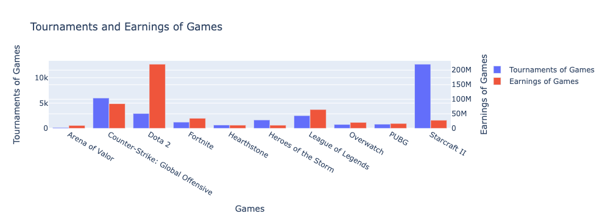

# Project of Data Visualization (COM-480)

| Student's name | SCIPER |
| -------------- | ------ |
| Li Shanci | 322772 |
| Luo Ruizhi | 323100 |
| Yu Aibin | 336380 |

## Technical Setup
The visualization can be open from both local and remote host:
* Github host: Click the [link](https://com-480-data-visualization.github.io/datavis-project-2022-lyl/web) to see the website.
* Local host: You can fork this project repository and open on you local machine.

### Setup local host
1. Clone the whole repo to your desired directory. A guide to install git could be found [Here](https://git-scm.com/book/en/v2/Getting-Started-First-Time-Git-Setup)
```
$ git clone git@github.com:com-480-data-visualization/datavis-project-2022-lyl.git
```
3. Setup the http server at the root folder of your local directory. A guide to install http server could be found [Here](https://www.npmjs.com/package/http-server)
```
../datavis-project-2022-lyl > http-server 
```
3. Open your browser and put the address of your http server (`http://localhost:8080/` as default)

## Intended Usage
Over the past few years, the eSports industry has been growing, the number of viewers watching these games has increased every year, eSports professional players and video game streaer have become a promising career.

However, people usually do not have an intuitive understanding of the income of e-sports practitioners. We hope to find out what the most popular games are currently through some data exploration and analysis, and display the income of players and teams interactively. We hope that our visualization could help the new gamers or pro gamers to decide which game to learn first or learn next based on popularity and which region is more promising based on the average salary.

The target audiences are:
* Teenagers who have talents in esports and want to be a professional player or vedio game streamer in the future. They need to search for the income of the top players in the field for the decision-making of their future career plan. For example, they want to know which gaming will let them earn more salary in the same genre.

* Investigators and advertising sponsor who want to promote their product in the tournament or the live streaming like Twitch. The salary of the practitioners the amount of the sponsorship will give them a general information about the popularity of the different games and the budget they need.

A user-guide demostration could be found with the following [Screencast](https://www.youtube.com/watch?v=CmxXkLCKh0k):

## Milestone 1 (8th April, 5pm)

**10% of the final grade**

### Dataset

The dataset is eSports earnings which is extracted from the kaggle. It provides information on the earnings of eSports players and teams. 

Link: https://www.kaggle.com/code/derisnoor/esports-earnings-eda/data

The dataset includes about 2k entries, corresponding to the detailed earnings of eSports players and teams from different countries and regions in 10 games such as Dota2, Fortnite, League of Legends, and so on.

The dataset is clean, we did not observe out-of-range numerical values or digital gibberish in-text attributes. It is ready for data exploration and visualization.


### Problematic

#### Overview 
The topic of our visualization project is to explore the earnings of eSports players and teams. The current scenes have been designed as follows:

1. The audience will be welcomed by a standard title sequence and a nice eSports picture.
2. The second scene showcases the 5 most popular of the 10 games. Clicking on a node triggers the game's theme song, and a brief intro to the game will be given. 
3. In the next scene, there is an interactive chart that shows players and teams with the highest earnings in distinct games.
4. In the final scene, a heat map of the world visualizes the average salary of esports players from different continents and countries. 


### Exploratory Data Analysis

#### About Data 

* The data includes 10 games and we can classify them according to the 5 genres. Multiplayer Online Battle Arena has the highest number of teams and players.

|            **Genre**            |                           **Game**                           | Teams | Players |
| :-----------------------------: | :----------------------------------------------------------: | :---: | :-----: |
|          Battle Royale          |                       [Fortnite, PUBG]                       |  200  |   200   |
|      Collectible Card Game      |                        [Hearthstone]                         |  80   |   100   |
|      First-Person Shooter       |        [Overwatch, Counter-Strike: Global Offensive]         |  200  |   200   |
| Multiplayer Online Battle Arena | [League of Legends, Dota 2, Heroes of the Storm, Arena of Valor] |  348  |   400   |
|            Strategy             |                        [Starcraft II]                        |  100  |   100   |

* A team can appear more than once but note that it is a different game.
* Since there are some star players in each game. There are lots of  'outliers' in the data, so it's better to use median rather than mean.



**Our data exploratory analysis and visualization are mainly based on the teams, players and country&continent point of view, which conclusively provides the following findings.**

#### From the team point of view

- From the plot we can see that actually Starcraft II has the lion's share of tournaments, followed by CSGO, Dota 2 and League of Legends. In fact, Starcraft 2 has more than 2X as much tournaments as CSGO. However, this is likely due to how long the game has been released and it only ranks fourth in revenue. While Dota 2 is the most earned game, which is almost 3x as much earnings as the second highest-earned game(CSGO).



- While it's true that MOBO brings in the highest total USD Prize won and median earnings, the median earnings for CSGO are highest. In addition, it should be mentioned that MOBA games has the highest number of competitors within the dataset. This could signify that MOBA is indeed the most popular and thus could explain the higher amount of money earned by teams since there would be more viewership.

#### From the player point of view

- Korea has the most esports players, followed by China and the United States of America. For the best earning player of every game, most are from Asia and Europe, only the player of Fortnite is from North America. 
- The earnings of players are quite different from teams. Although MOBA is still the highest total USD Prize, the median earnings for FPS are the highest. If we looked into the game, players from DOTA2 earn the highest median USD Prize, which is not CSGO anymore.

#### From country&continent point of view ####

- Country and Continent Interestingly, it seems that China has the most amount of ESports earnings. If we look at Continent, Asia and Europe largely dominates in terms of total USD earned. However, if we look at it from other dimension. Countries like Lebonon and Parkistan take the cake.
- Countries like China and Korea probably have a way higher population that are into ESports, thus resulting in higher total earnings. Countries like Parkistan and other less developed countries probably aren't as accepting of ESports culture, so you would have to be really good to get into it, which explains higher median earnings. Some of the lower player count country has "elite" players while popular countries have sheer numbers.


### Related work


> - What others have already done with the data?

1. [esports_earnings_EDA](https://www.kaggle.com/code/derisnoor/esports-earnings-eda)

2. [eSports Earnings: Data Visualization and Exploration](https://www.kaggle.com/code/hbakker/esports-exploratory-analysis)


3. [e_sport_data_explore](https://www.kaggle.com/code/jefsuu/e-sport-data-explore)


4. [Esports: Exploratory Analysis](https://www.kaggle.com/code/hbakker/esports-exploratory-analysis)


> - Why is your approach original?

Most of the Exploratory Data Analysis of the above related works use static visualization and only present statistics values. We want to perform the visualization more interactive and more interesting. Besides the necessary values to show, we would like to use more logos, music and convert the tables to interactive UI blocks. Through our informative design and considerate introduction, the audience can acknowledge the general information of the industry quickly and precisely even if they do not know about the field before.

> - What source of inspiration do you take? Visualizations that you found on other websites or magazines (might be unrelated to your data).

1.  [eSports: Should You Start a Startup?](https://public.tableau.com/app/profile/jack.daoud/viz/eSportsReport/Story)
* This is the project created by the publisher of the dataset. Combined with other datasets, he presents several aspects of the esports industry vivid and informatively.

2. [Esports Viewership Stats for 2018](https://escharts.com/2018) 
* Esports Charts is a unique analytical agency collecting all information about esports, streaming and providing actual fact data. In this web page, they visualized the viewership statistics for 2018. They showed lots of statistics while most of them are bar charts and non-interactive. However, we like the background layout and the way they use dynamic visualization of static bar values.


## Milestone 2 (6th May, 5pm)

**10% of the final grade**

The report for Milestone 2: [Milestone 2 - Report](milestones/milestone2.pdf)

The skeleton code is in the  `web` folder, click [link](https://com-480-data-visualization.github.io/datavis-project-2022-lyl/web) to see the website frame work.

## Milestone 3 (3rd June, 5pm)

**80% of the final grade**


## Late policy

- < 24h: 80% of the grade for the milestone
- < 48h: 70% of the grade for the milestone
